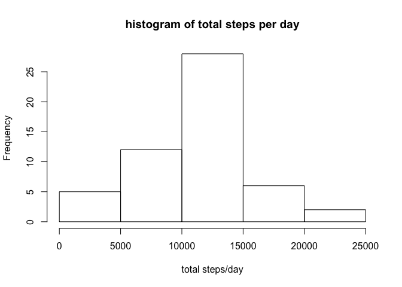
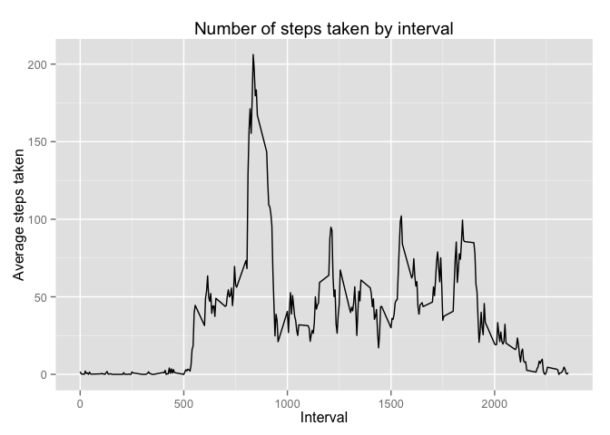
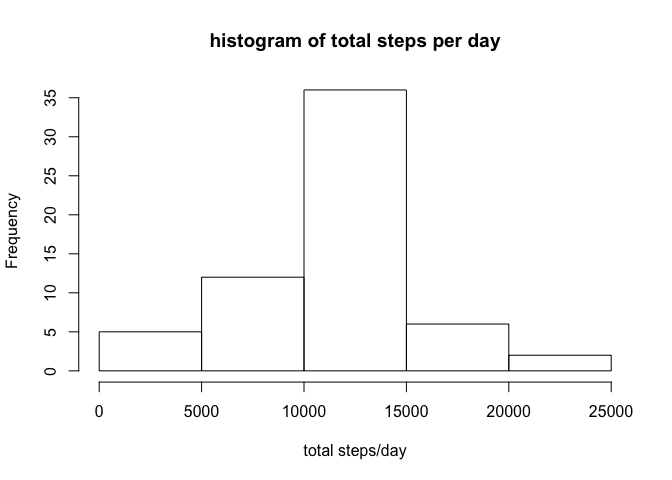
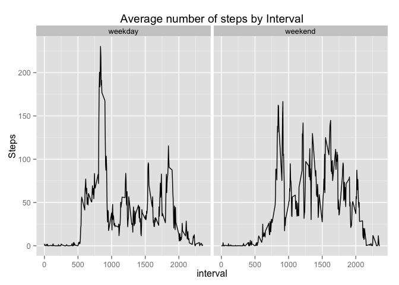

# Reproducible Research: Peer Assessment 1


## Loading and preprocessing the data

```r
## read the activity data
activity_df <- read.csv("activity.csv")
## convert the date variable to date format
activity_df$date <- as.Date(activity_df$date, format="%Y-%m-%d")
```


## What is mean total number of steps taken per day?

```r
## calculate the total number of steps per day.
activity_array <- tapply(activity_df$steps,activity_df$date,FUN=sum)
## histogram of total steps per day
hist(activity_array,main = "histogram of total steps per day", xlab="total steps/day")
```

 


```r
## calculate the mean & median value for daily total number of steps per day
mevalue <- mean(activity_array, na.rm=TRUE)
mdvalue <- median(activity_array, na.rm=TRUE)
```

##### The mean of total number of steps taken per day is *1.0766189\times 10^{4}* and median is *10765*


## What is the average daily activity pattern?

```r
## calculate the average number of steps across the different time intervals, averaged across all days
interval_array <- tapply(activity_df$steps,activity_df$interval,FUN=mean,na.rm=TRUE)
intervals <- as.numeric(names(interval_array))
interval_df = data.frame(interval = intervals, average_steps = interval_array)

library(ggplot2)
```

```
## Warning: package 'ggplot2' was built under R version 3.1.3
```

```r
## Make a time series plot of the interval (x axis) and average number of steps taken
ggplot() + geom_line(data = interval_df, aes(x=interval, y=average_steps)) + xlab("Interval") + 
  ylab("Average steps taken") + ggtitle("Number of steps taken by interval")
```

 


```r
## calculate the interval that has the maximum average number of steps
max_interval <- as.numeric(subset(interval_df, average_steps == max(average_steps),select=interval))
```

##### As per the analysis, the maximum number of steps on an average is taken during the *835* th  interval


## Imputing missing values

**Strategy to impute missing values:** Replace the missing values in the "steps" variable with the average steps for that particular interval (calculated from previous step) 

```r
## find the number of records with NA values
na_records <- length(which(is.na(activity_df$steps)))
## replace the missing values with mean of the intervals calculated in the previous step
na_index <- which(is.na(activity_df$steps))
new_df <- activity_df
for (i in 1:na_records) {
  new_df[na_index[i],1] <- interval_df[,2][new_df[na_index[i],3] == interval_df[,1]]
}

## Draw a histogram with the new activity values
new_activity_array <- tapply(new_df$steps,new_df$date,FUN=sum)
hist(new_activity_array,main = "histogram of total steps per day", xlab="total steps/day")
```

 


```r
## calculate the mean and median of the new activity values (Non-NA)
newmean <- mean(new_activity_array)
newmedian <- median(new_activity_array)
```

##### The new mean of total number of steps taken per day is *1.0766189\times 10^{4}* and new median is *1.0766189\times 10^{4}*  
The mean remains the same even after imputing the missing values and is same as the one calculated in the previous step with "NAs" removed, while the median has now shifted to the mean


## Are there differences in activity patterns between weekdays and weekends?

```r
## creating a factor variable to represent day of the week from the date variable 
new_df$dayofweek <- factor(weekdays(new_df$date))

## creating the levels
levels(new_df$dayofweek)[levels(new_df$dayofweek) == "Monday"] <- "weekday"
levels(new_df$dayofweek)[levels(new_df$dayofweek) == "Tuesday"] <- "weekday"
levels(new_df$dayofweek)[levels(new_df$dayofweek) == "Wednesday"] <- "weekday"
levels(new_df$dayofweek)[levels(new_df$dayofweek) == "Thursday"] <- "weekday"
levels(new_df$dayofweek)[levels(new_df$dayofweek) == "Friday"] <- "weekday"
levels(new_df$dayofweek)[levels(new_df$dayofweek) == "Saturday"] <- "weekend"
levels(new_df$dayofweek)[levels(new_df$dayofweek) == "Sunday"] <- "weekend"

## seperate the dataframe into seperate data for weekday and weekend
weekday_steps <- subset(new_df,dayofweek == "weekday", select = c(steps,interval,dayofweek))
weekend_steps <- subset(new_df,dayofweek == "weekend", select = c(steps,interval,dayofweek))

## calculate the average steps taken by interval 
wd_interval_arr <- tapply(weekday_steps$steps,weekday_steps$interval,FUN=mean,na.rm=TRUE)

we_interval_arr <- tapply(weekend_steps$steps,weekend_steps$interval,FUN=mean,na.rm=TRUE)

## create the dataset for plotting the timeseries graph
wd_df <- data.frame(interval = intervals, average_steps = wd_interval_arr)
we_df <- data.frame(interval = intervals, average_steps = we_interval_arr)

wd_df$dayofweek <- factor(c("weekday"))
we_df$dayofweek <- factor(c("weekend"))

weeklyactivity_df <- rbind(wd_df,we_df)

## create the plot
p <- qplot(interval, average_steps, data = weeklyactivity_df,geom="line",main = "Average number of steps by Interval", xlab = "interval", ylab = "Steps" )
p + facet_wrap(~dayofweek)
```

 

From the above analysis, it is evident that the average number of steps taken during weekdays are higher than weekend.
